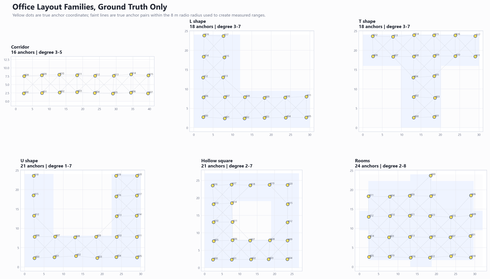

# AnchorGeometrySolver

Bundled workspace for the SmartClicker anchor geometry solver experiments.

The repository preserves the original experimental scripts under `work/` so older command lines and imports keep working. It also includes the patched `SmartClicker-GUI` source snapshot used by the experiments, especially `work/SmartClicker-GUI/uwb_capture/anchor_geometry.py`.

## Layout

- `anchor_geometry_solver/` - reusable benchmark harness package for generated cases, solver methods, sweeps, summaries, and CLI runs.
- `configs/` - benchmark and sweep configs.
- `work/anchor_solver_*.py` - simulation, seed, graph-scaffold, ML, PPO, and evaluation scripts from the solver exploration.
- `work/agent_*.py` - parallel sweep/probe helpers used during graph-shortest and ML-distance experiments.
- `work/SmartClicker-GUI/` - cloned SmartClicker GUI source with the current anchor geometry implementation.
- `docs/results/` - compact CSV result snapshots worth keeping in git.
- `outputs/` - local generated figures, logs, checkpoints, and large result files. This directory is intentionally ignored except for `.gitkeep`.

## Setup

```powershell
python -m venv .venv
.\.venv\Scripts\python -m pip install --upgrade pip
.\.venv\Scripts\python -m pip install -r requirements.txt
```

For CUDA training, install a CUDA-enabled PyTorch wheel that matches the local driver instead of the default CPU wheel if needed.

## Harness

New solver work should go through the `anchor_geometry_solver` package. The legacy scripts in `work/` remain available, but the harness gives us reusable case generation, solver method specs, grid expansion, parallel execution, and standard CSV output.

Config files live under `configs/`. A benchmark config has:

- `layouts`: generated layout buckets or explicit random/grid shape requests.
- `methods`: solver pipelines; add `grid` under a method to sweep parameters.
- `runner`: `serial`, `thread`, or `process` execution plus output location.

Run a tiny dependency-light smoke, or a graph-shortest YAML sweep after installing `requirements.txt`:

```powershell
python -m anchor_geometry_solver bench configs/sweeps/tiny_serial.json
python -m anchor_geometry_solver bench configs/sweeps/graph_scaffold_smoke.yaml
```

Each run writes:

```text
outputs/<benchmark-name>/
  detail.csv
  summary.csv
```

Use `thread` or `process` backends for expensive sweeps. The nonlinear solver still sets BLAS thread counts to one in worker processes so case-level parallelism does not fight with library-level threading.

Visibility-aware methods now available in configs:

- `visibility_branching`: beam search trilateration seed with missing-edge and graph-shortest scoring.
- `visibility_relaxed`: lightweight relaxed visibility seed without CVXPY.
- `visibility_sdp`: CVXPY/PSD Gram-matrix visibility seed, then nonlinear polish.

Set `constrained_polish: true` on `graph_shortest`, `visibility_branching`, `visibility_relaxed`, or `visibility_sdp` to use the optional final hinge solver. Missing edges use `max(0, radio_radius + margin - distance)` and graph-shortest bounds use `max(0, distance - upper_bound)`.

## Generated Layouts

The current office-layout validation bucket uses grid-like anchor placement in
six shape families: corridor, L shape, T shape, U shape, hollow square, and
rooms. The diagram below shows representative ground-truth layouts only; faint
lines are true anchor pairs within the 8 m radio radius before range noise is
added.



## Current Best Solver

As of the checked-in `visibility_tuned_validation` run, the best overall
non-ML solver is `visibility_branching_tuned`. On 90 fresh fair validation
cases, 16-24 anchors with minimum vertex connectivity 3, it reached median max
offset `0.180 m`, p95 max offset `0.443 m`, worst-case max offset `0.982 m`,
and `100%` under 1 m.

```json
{
  "solver": "visibility_branching",
  "iterations": 45,
  "beam_width": 32,
  "optimizer_seeds": 16,
  "radio_radius_m": 8.0,
  "missing_margin_m": 0.25,
  "missing_weight": 8.0,
  "missing_sigma_m": 0.75,
  "graph_upper_weight": 0.35,
  "graph_upper_factor": 1.0,
  "graph_upper_slack_m": 0.75,
  "graph_upper_sigma_m": 1.0,
  "final_visibility_weight": 1.0,
  "constrained_polish": true,
  "constrained_iterations": 55,
  "constrained_known_weight": 1.0
}
```

The best fast alternate is `visibility_sdp_tuned`. It had median max offset
`0.181 m`, p95 max offset `0.483 m`, worst-case max offset `1.057 m`, and
median runtime `1.66 s` versus `5.10 s` for tuned branching on the same run.

```json
{
  "solver": "visibility_sdp",
  "iterations": 45,
  "radio_radius_m": 8.2,
  "missing_margin_m": 0.25,
  "known_weight": 1.0,
  "missing_weight": 1.0,
  "missing_sigma_m": 0.5,
  "graph_upper_weight": 0.05,
  "graph_upper_factor": 1.1,
  "graph_upper_slack_m": 1.5,
  "graph_upper_sigma_m": 1.0,
  "constrained_polish": true,
  "constrained_iterations": 55,
  "sdp_solver": "SCS",
  "sdp_max_iters": 3000,
  "sdp_eps": 0.0002
}
```

## Useful Legacy Entry Points

```powershell
python work/anchor_solver_graph_scaffold_weight_sweep_buckets.py --help
python work/anchor_solver_weighted_ppo_strong.py --help
python work/anchor_solver_weighted_ppo_curriculum.py --help
python work/anchor_solver_p95_solver_case_compare.py --help
```

The recent graph-shortest baseline has usually been run with settings close to:

```powershell
python work/anchor_solver_p95_solver_case_compare.py --solver graph_shortest --max-hops 2 --relative-sigma 0.30 --scaffold-weight 2.0 --hop-weight-base 1.4
```

For PPO curriculum work on Windows, prefer `--solve-threads 1` on strong evaluation/training branches until the native threaded nonlinear solve crash is fully eliminated.

## Current Notes

- Sparse anchor edges are generated from noisy known ranges; fair layouts should enforce at least three known connections per anchor.
- Graph-shortest scaffold remains a useful cheap baseline, but the tuned visibility branching solver is the current best checked-in result.
- The weighted PPO model is useful for experimentation, but it is not the current top documented solver.
- Checkpoints and large generated outputs stay out of git. Put durable conclusions and compact documentation figures in `docs/`, and regenerable bulk artifacts in `outputs/`.
